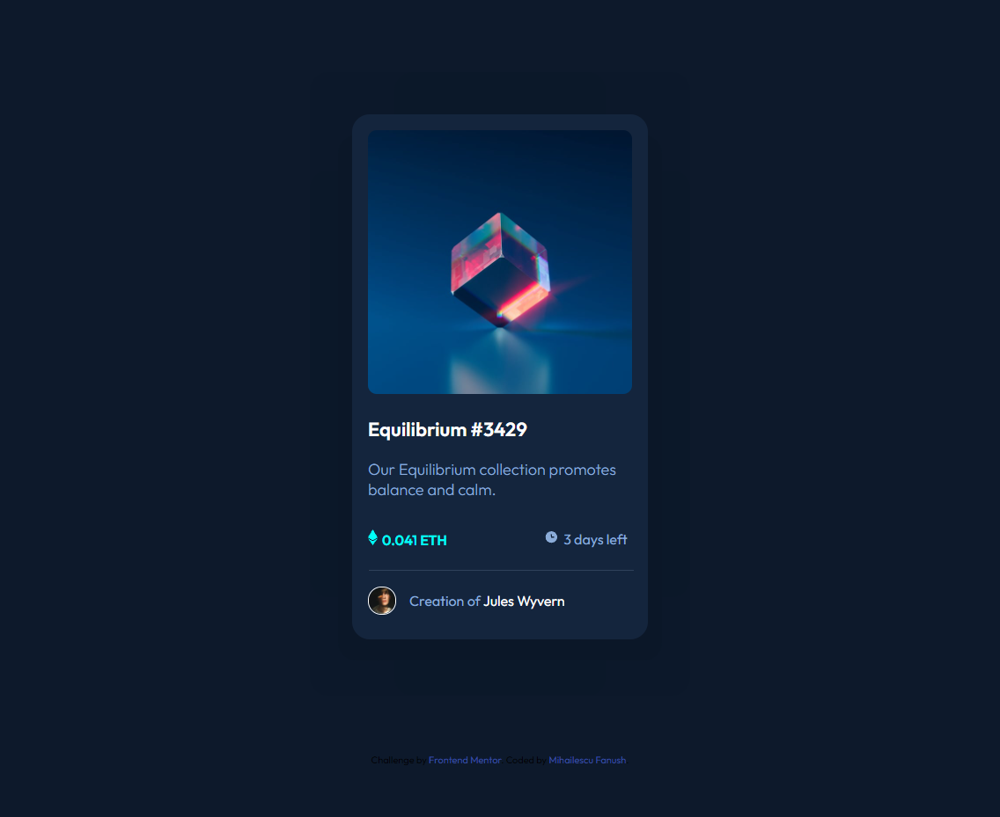
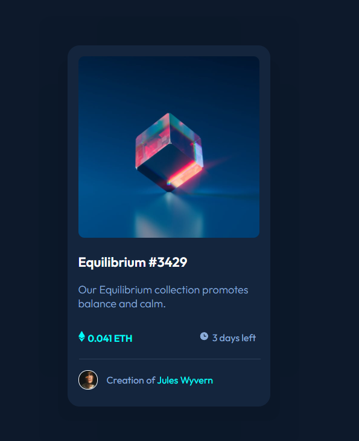
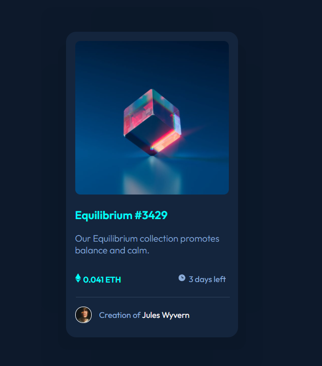
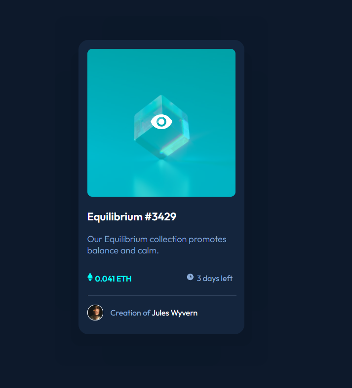
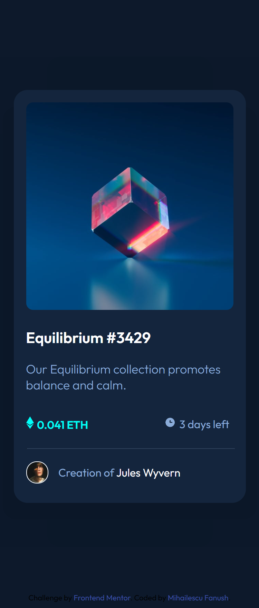

# Frontend Mentor - NFT preview card component solution

This is a solution to the [NFT preview card component challenge on Frontend Mentor](https://www.frontendmentor.io/challenges/nft-preview-card-component-SbdUL_w0U). Frontend Mentor challenges help you improve your coding skills by building realistic projects. 

## Table of contents

- [Overview](#overview)
  - [The challenge](#the-challenge)
  - [Screenshot](#screenshot)
  - [Links](#links)
- [My process](#my-process)
  - [Built with](#built-with)
  - [What I learned](#what-i-learned)
  - [Continued development](#continued-development)
  - [Useful resources](#useful-resources)
- [Author](#author)
- [Acknowledgments](#acknowledgments)

**Note: Delete this note and update the table of contents based on what sections you keep.**

## Overview

### The challenge

Users should be able to:

- View the optimal layout depending on their device's screen size
- See hover states for interactive elements

### Screenshot

### Links

- Solution URL: [Add solution URL here](https://github.com/Fanushhh/nft-preview-card-component)
- Live Site URL: [Add live site URL here](https://your-live-site-url.com)

### Built with

- Semantic HTML5 markup
- CSS custom properties
- Flexbox

### What I learned

One of the many things I learned through this challenge was to apply shadow to an html element. At first, I thought it would be a simple process, who knew there are so many options to that, like spread radius, blur and so on. Additionally, getting that horizontal line was a challange as well because the horizontal rule is made out of 4 sides and to get to that level of thickness you have to remove the ones from the sides and either leave the one from the bottom or from the top.

### Useful resources

(https://www.w3schools.com/cssref/css3_pr_box-shadow.asp) - This helped me get a grasp on how to toy with shadows on an object.

## Author

- Website - [Mihailescu Fanush Gabriel](https://fanushhh.github.io/Stylized-Website/)
- Frontend Mentor - [@fanushhh](https://www.frontendmentor.io/profile/Fanushhh)

